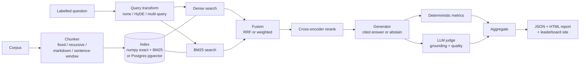

# RAGArena

**Head-to-head benchmarking for RAG pipelines.** Retrieval quality, answer faithfulness, latency and cost — measured in one run, on your own corpus, and written out as a leaderboard you can commit to git.

[](https://github.com/shahriar-ahmed-seam/ragarena/actions/workflows/ci.yml)
[](https://pypi.org/project/ragarena/)
[](https://pypi.org/project/ragarena/)
[](LICENSE)

> Live leaderboard: **https://ragarena.vercel.app**

---

## Why

Every RAG tutorial ends at "and now add a reranker." Nobody shows you what that actually bought: how much quality, at what latency, for how many dollars. Teams ship hybrid search and query expansion on vibes, then discover in production that the expensive pipeline hallucinates more than the cheap one on the questions that matter.

RAGArena makes that comparison a single command. It runs the same labelled question set through several retrieval strategies against the same corpus, then reports one row per strategy with quality, latency and cost side by side.

```bash
pip install ragarena
ragarena bench --suite default
```

```
                                  Leaderboard
  #  strategy                 arena   faith  correct  ctx prec   cite  abstain   p95 ms   $/1k
  1  Multi-query + rerank     0.928   0.952    0.929     0.917  0.814    0.974     5991   0.13
  2  HyDE + rerank            0.927   0.952    0.929     0.913  0.814    0.974     5153   0.15
  3  Hybrid + RRF             0.918   0.939    0.918     0.901  0.823    0.974     1506   0.10
  4  Hybrid + rerank          0.918   0.937    0.922     0.915  0.808    0.962     2352   0.10
  5  Hybrid + rerank (wide)   0.918   0.937    0.922     0.914  0.808    0.962    13710   0.10
  6  Dense only               0.906   0.938    0.910     0.865  0.814    0.962     1533   0.10
  7  BM25 only                0.889   0.899    0.914     0.852  0.808    0.949     1687   0.10
  run took 565s - serving $0.0454 + judging $0.0999
```

*78 labelled questions over a 20-document corpus. Local CPU retrieval stack, DeepSeek V4 Flash generating, V4 Pro judging.*

### Three things this found that I would not have guessed

**Doubling the reranker's candidate pool bought exactly nothing and cost 5.8× the latency.** `hybrid-rerank` (20 candidates) and `hybrid-rerank-wide` (40) are identical to three decimals on every quality metric. p95 went 2,352 ms → 13,710 ms. Recall was never the binding constraint — `hit_rate` was already 1.000 at 20.

**Chunking is worth as much as the entire strategy ladder.** Swapping only the chunker, with retrieval held fixed, moved the composite 2.4 points; seven different retrieval architectures spanned 3.9. And a dumb 180-word fixed window beat heading-aware markdown splitting on a corpus that is entirely markdown with clean headings.

**Citation validity is the weakest metric in every run — never above 0.823 — while faithfulness sits at 0.94.** The answers are right and the sources are roughly right. For a product that renders sources as clickable links, roughly right is a bug users find. Reranking makes it worse, because it permutes the passages the model numbered its citations against.

Full write-up in [`docs/findings.md`](docs/findings.md); raw artefacts in [`results/`](results/).

---

## What it measures

| Metric | Type | What it catches |
| --- | --- | --- |
| `faithfulness` | LLM judge, claim-level | Sentences the retrieved context does not support. Scored as supported claims ÷ total claims, so one fabricated fact in a good answer still shows up. |
| `answer_correctness` | LLM judge, 0-4 rubric | Disagreement with the reference answer. |
| `answer_relevance` | LLM judge, 0-4 rubric | Answers that are true but do not address the question. |
| `context_precision` | Deterministic | Relevant chunks ranked above irrelevant ones (rank-sensitive). |
| `hit_rate`, `doc_recall`, `precision@k`, `mrr`, `ndcg@k` | Deterministic | Classic retrieval quality against labelled relevant documents. |
| `citation_validity` | Deterministic | Answers that cite the *wrong* passage. Invisible to text-similarity metrics, fatal for a product that shows sources. |
| `abstention_correct` | Deterministic | Whether the pipeline refused exactly when it should have. Scored on answerable questions too, so a chronic refuser is penalised. |
| `hallucination_rate` | Deterministic | Share of unanswerable questions answered anyway. |
| `arena_score` | Composite | Weighted headline: faithfulness 35%, correctness 25%, context precision 20%, citation validity 10%, abstention 10%. |
| p50 / p90 / p95 / p99 latency | Measured | End-to-end and per stage (embed → retrieve → rerank → generate). Cache hits excluded. |
| Cost per 1k queries | Measured | Real token counts × published provider prices. Serving cost and judging cost are reported separately. |

---

## Architecture



A "strategy" is a point in one configuration space rather than a bespoke class, so the benchmark axes compose:

```python
PipelineConfig(
    retriever="hybrid",          # dense | lexical | hybrid
    query_transform="multiquery",# none | hyde | multiquery
    rerank=True,
    fusion="rrf",                # rrf | weighted
    top_k=5,
    candidate_k=30,
)
```

### Design decisions worth knowing

- **Exact dense search by default.** The in-memory backend does a full matrix multiply instead of ANN, so a strategy comparison measures the strategy and not HNSW tuning. Switch to `--index pgvector` to measure the production path.
- **One index per distinct chunker.** Strategies that share chunking share an index, so a seven-strategy run embeds the corpus once.
- **Serving cost ≠ evaluation cost.** The judge is usually the priciest model in the run. Folding it into "cost per 1k queries" would make every strategy look identical and wrong, so they are tracked and reported separately.
- **Everything is cached.** Provider calls are keyed by exact request payload in SQLite, so re-runs are fast and free. Latency percentiles exclude cache hits, because a cached run measures SQLite rather than your pipeline.
- **Thinking mode off.** DeepSeek V4 enables chain-of-thought by default; RAGArena disables it for both generation and judging so scores are stable and cheap.

---

## Install

```bash
pip install ragarena                 # hosted providers (Voyage AI + any OpenAI-compatible LLM)
pip install "ragarena[local]"        # + fastembed: local CPU embeddings and reranker, no API keys
pip install "ragarena[pgvector]"     # + psycopg: Postgres/pgvector index backend
pip install "ragarena[all]"          # everything
```

Requires Python 3.10+.

## Configure

```bash
cp .env.example .env
```

```env
# Generator / judge: any OpenAI-compatible chat endpoint
DEEPSEEK_API_KEY=sk-...
RAGARENA_LLM_BASE_URL=https://api.deepseek.com
RAGARENA_GENERATOR_MODEL=deepseek-v4-flash
RAGARENA_JUDGE_MODEL=deepseek-v4-pro

# Embeddings + reranking
RAGARENA_EMBED_PROVIDER=voyage
RAGARENA_EMBED_MODEL=voyage-4-lite
RAGARENA_RERANK_PROVIDER=voyage
RAGARENA_RERANK_MODEL=rerank-2.5-lite
VOYAGE_API_KEY=pa-...
```

Verify everything is wired up:

```bash
ragarena doctor
```

### Running with zero API keys

```bash
ragarena bench --suite quick --no-judge \
  --embed-provider fastembed --rerank-provider crossencoder
```

`fastembed` runs `BAAI/bge-small-en-v1.5` and `ms-marco-MiniLM-L-6-v2` on CPU via ONNX. There is also a `hash` embedding provider: deliberately bad, deterministic, no downloads, useful in CI and as an honest lower bound on the leaderboard.

---

## Usage

```bash
# Full suite on the bundled dataset
ragarena bench

# Fast smoke test: 4 strategies, 10 questions, no judge
ragarena bench --suite quick --limit 10 --no-judge

# Does chunking matter more than retrieval? Same retrieval, four chunkers.
ragarena bench --suite chunking

# Pick your own contenders
ragarena bench --strategies bm25-only,hybrid-rrf,hybrid-rerank

# Compare embedding models on the same corpus
ragarena bench --embed-model voyage-4       --notes "voyage-4"
ragarena bench --embed-provider fastembed   --notes "bge-small local"

# Your own corpus
ragarena bench --dataset ./my-dataset

# Production index path
ragarena bench --index pgvector    # needs DATABASE_URL

# Poke at a single question
ragarena ask "How long are webhook delivery logs kept?" --strategy hybrid-rerank --context

ragarena strategies     # list presets
ragarena datasets       # list bundled datasets
ragarena cache --clear  # drop cached provider calls
```

Each run writes:

```
results/
  <run-id>.json        full artefact, every question trace
  <run-id>.html        self-contained report, no CDN, opens offline
  latest.json          compact payload consumed by the leaderboard site
```

### Python API

```python
import asyncio
from ragarena import BenchmarkRunner, Settings, build_suite, load_dataset

async def main():
    result = await BenchmarkRunner(
        Settings.from_env(),
        load_dataset("meridian"),
        build_suite(["hybrid-rrf", "hybrid-rerank"]),
    ).run()

    for s in result.leaderboard():
        print(f"{s.label:24} arena={s.metrics['arena_score']:.3f} p95={s.latency.p95_ms:.0f}ms")

asyncio.run(main())
```

---

## Bring your own dataset

```
my-dataset/
  dataset.json          {"name": "...", "version": "1", "description": "..."}
  docs/
    billing-policy.md   filename stem becomes the document id
    api-reference.md
  questions.jsonl
```

```jsonc
{
  "id": "q001",
  "question": "What is the rate limit for a single API key?",
  "ground_truth": "600 requests per minute with a burst of 100.",
  "relevant_doc_ids": ["api-reference"],       // required when answerable
  "relevant_snippets": ["600 requests per minute"], // optional: chunk-level ground truth
  "answerable": true,
  "type": "numeric",         // factoid | numeric | multi_hop | comparison | unanswerable
  "difficulty": "easy",      // easy | medium | hard
  "tags": ["api", "limits"]
}
```

`relevant_snippets` is worth filling in: it makes relevance judgements survive a chunking change, so the chunking sweep stays meaningful.

Loading validates the dataset and fails loudly on unknown document ids or answerable questions with no labels, rather than silently scoring zero.

### The bundled dataset

`meridian` is a synthetic knowledge base for a fictional logistics API company: 12 documents (API reference, SRE runbook, incident postmortem, security policy, retention policy, billing, onboarding, HR) and 52 labelled questions.

It was written from scratch for this project, which matters for two reasons: no licensing restrictions, and it cannot have leaked into any model's training data. It is deliberately adversarial — several different timeouts and retention windows across documents so lexical search has real distractors, cross-document multi-hop questions, arithmetic questions, and 7 unanswerable questions whose vocabulary overlaps heavily with real content.

---

## Docs

- [`docs/metrics.md`](docs/metrics.md) — how every metric is computed, and what it misses
- [`docs/strategies.md`](docs/strategies.md) — the strategy space and what each knob does
- [`docs/findings.md`](docs/findings.md) — results from the committed runs
- [`docs/architecture.md`](docs/architecture.md) — module map and extension points

## Limitations

LLM-as-judge is not ground truth. It correlates well with human grading on factoid and numeric questions and less well on open-ended ones, which is exactly why the deterministic retrieval metrics are reported alongside and why the report shows the judge's reasoning for every question. Judge with a different model than you generate with, and read the failures.

Absolute numbers are corpus-specific. The ranking of strategies on your documents is the useful output; a faithfulness figure from someone else's corpus is not.

## License

MIT — see [LICENSE](LICENSE).
